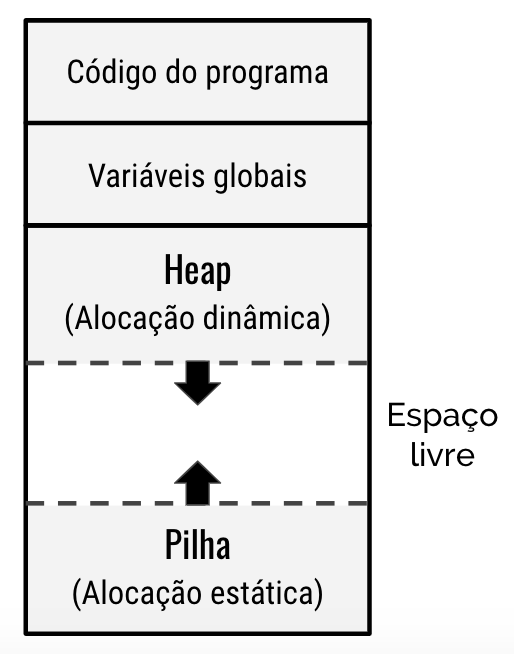

# Home

A disciplina de **Algoritmos e Estrutura de Dados 1** é lecionada no 2o período do curso de Ciência da Computação da Universidade Tecnológica Federal do Paraná - Câmpus Campo Mourão. 

## Objetivos
- Ampliar o conhecimento na formulação de algoritmos para a solução de problemas. 
- Manipular estruturas de dados lineares com alocação estática e dinâmica. 
- Acessar e manipular arquivos por meio da linguagem de programação.

## Ementa
- Estruturas de dados heterogêneas.
- Arquivos. 
- Ponteiros e referência. 
- Listas em alocação estática e alocação dinâmica.

## Referência
- [teste](https://repl.it/@liberato/TADData)

- <a href="https://repl.it/@liberato/TADData" target="_blank">Código</a>

